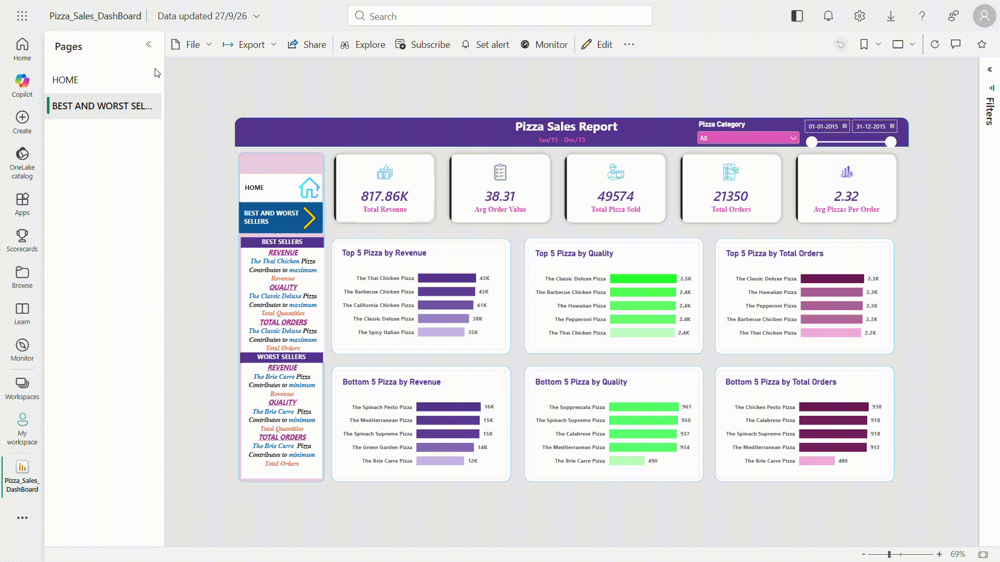
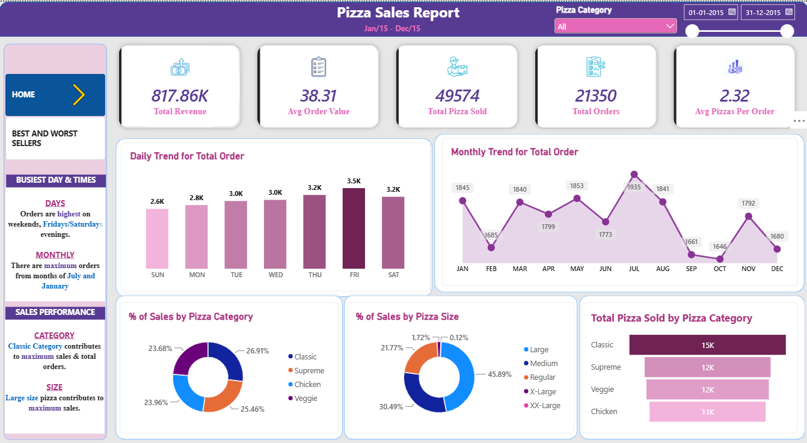
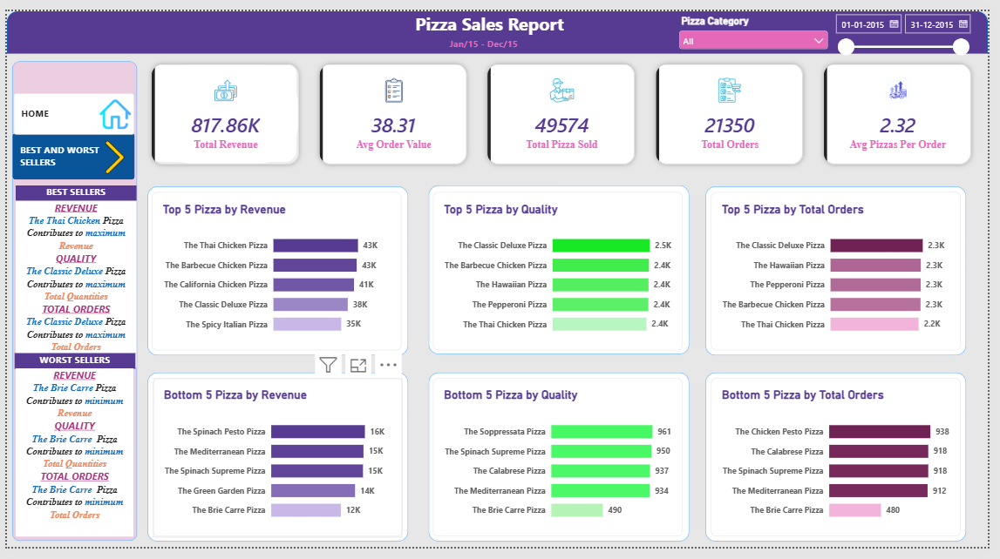

# Pizza Sales Dashboard – Power BI

An interactive Power BI dashboard analyzing a full year (Jan–Dec 2015) of pizza sales data — built to answer three questions a sales manager would actually ask: *what's selling, when are we busiest, and what should we stop making?*

## Demo

📄 **[View the full report (PDF)](./dashboard/Pizza_Sales_Report.pdf)** — no login or software needed
🎞️ Walkthrough GIF below shows the slicer, date filter, and page navigation in action

*(Built in Power BI Desktop — `.pbix` file included in [`/dashboard`](./dashboard) if you'd like to open it live.)*

## Problem Statement

A pizza chain wants to understand its 2015 sales performance across categories, sizes, and time periods to guide inventory planning, staffing on peak days, and menu decisions (which pizzas to promote vs. discontinue).

## Dataset

- ~21,350 orders / ~49,574 pizzas sold across 2015
- Fields: order date/time, pizza name, category, size, quantity, unit price
- Source: [name your source here, e.g. Kaggle "Pizza Place Sales"]

## Tools Used

- **Power BI Desktop** — data modeling, DAX measures, dashboard design
- **Power Query** — data cleaning and transformation
- **DAX** — calculated measures (revenue, AOV, % of sales, MoM comparisons)

## Data Cleaning & Modeling Notes

- Removed duplicate order line items before aggregating quantities
- Built a dedicated date table for proper time-intelligence (daily/monthly trend, day-of-week analysis)
- Standardized category and size labels for consistent grouping
- Excluded incomplete orders with null pizza IDs

## Dashboard Pages

### 1. Home — Executive Overview

- **KPIs:** $817.86K total revenue · $38.31 avg order value · 49,574 pizzas sold · 21,350 total orders · 2.32 avg pizzas/order
- **Daily trend:** orders peak on **Friday and Saturday evenings**
- **Monthly trend:** highest order volume in **July and January**
- **Category split:** Classic (26.9%) and Chicken (25.5%) lead; Veggie and Supreme close behind
- **Size split:** Large (45.9%) is the dominant size, followed by Medium (30.5%)

### 2. Best and Worst Sellers

- **Top revenue drivers:** Thai Chicken, Barbecue Chicken, California Chicken
- **Top by order count:** Classic Deluxe, Hawaiian, Pepperoni
- **Lowest performers across all three metrics:** Brie Carre, Mediterranean, Spinach Supreme — consistent bottom-5 across revenue, quantity, and orders

## Key Insights & Recommendations

1. **Weekend + Friday demand spike** → increase weekend staffing and pre-prep inventory ahead of Friday/Saturday rushes.
2. **Chicken-based pizzas dominate revenue despite Classic having more orders** → chicken pizzas carry a higher price point; consider promoting them further given strong margins.
3. **Large size drives ~46% of sales** → prioritize Large-size ingredient stock over XX-Large, which sits at just 0.12% of sales and may not be worth keeping on the menu.
4. **Brie Carre and Mediterranean rank in the bottom 5 across every metric** → candidates for menu removal or a relaunch with repricing/reformulation.
5. **July and January are peak months** → plan seasonal marketing pushes and staffing around these two months specifically, rather than a flat year-round plan.

## How to Reproduce

1. Clone this repo
2. Open `dashboard/Pizza_Sales_Report.pbix` in Power BI Desktop
3. Data source is embedded; refresh via Home → Refresh if you swap in your own dataset

## Contact

**Shatakshi Singh**
[LinkedIn](https://linkedin.com/in/shatakshi-singh-256625219/) · [GitHub](https://github.com/shatakshisingh28) · shatakshis@gmail.com
